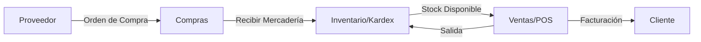

# Documento Maestro: Arquitectura y Auditoría - Inversiones Svan

Este documento consolida el análisis técnico del sistema de logística para la compra y venta de alimento para animales.

---

## PASO 1 — Inventario del Código

### Backend (Python/FastAPI)
- **Archivos Raíz**: `server.py` (Monolito principal), `requirements.txt`, `.env`.
- **Modelos (Pydantic)**: `User`, `Producto`, `Cliente`, `Proveedor`, `Venta`, `Compra`, `Movimiento`, `Token`.
- **Rutas (API)**:
  - `/auth`: Login, Registro, Me.
  - `/productos`: CRUD y Alertas de stock.
  - `/clientes`: Gestión de cartera de clientes.
  - `/proveedores`: Gestión de proveedores.
  - `/compras`: Órdenes de compra y recepción de mercadería.
  - `/ventas`: Facturación y salida de inventario.
  - `/inventario`: Kardex y movimientos manuales.
  - `/dashboard`: Estadísticas generales.
  - `/reportes`: Exportación Excel/PDF.

### Frontend (React/CRACO)
- **Framework**: React 19 (vía CRA/CRACO). *Nota: No es Next.js, sino Single Page Application (SPA).*
- **Carpetas**:
  - `src/components`: UI components (Shadcn) y modales de negocio (`ClienteFormModal`).
  - `src/context`: Gestión de estado global (`AuthContext`, `CartContext`).
  - `src/hooks`: Custom hooks como `use-toast.js`.
  - `src/lib`: Integración con API (`api.js`) y utilidades.
  - `src/pages`: 10 vistas principales (Dashboard, Ventas, Compras, etc.).
- **Estándar Visual**: Tailwind CSS, Lucide Icons, Shadcn UI.

---

## PASO 2 — Documento Maestro de Arquitectura

### 1. Descripción General
Sistema ERP/Logístico diseñado para la gestión de inventario y flujo de caja en el sector de retail industrial de alimento para animales. Controla desde el abastecimiento con proveedores hasta la venta final al cliente, automatizando el Kardex.

### 2. Stack Tecnológico Confirmado
- **Backend**: FastAPI (Asíncrono), Motor (MongoDB Driver), ReportLab (PDF), XlsxWriter (Excel).
- **Frontend**: React 19, Tailwind CSS, Shadcn UI, Axios, React Router 7.
- **Base de Datos**: MongoDB (NoSQL) con esquema flexible pero validado por Pydantic.

### 3. Módulos Principales
- **Abastecimiento**: Control de órdenes de compra (OC) y actualización de precios de costo.
- **Inventario**: Control de stock en tiempo real con alertas de stock bajo.
- **Ventas (POS)**: Punto de venta con gestión de carrito y emisión de comprobantes.
- **Inteligencia**: Dashboard de rentabilidad y reportes de gestión.

### 4. Modelo de Datos (Colecciones MongoDB)
- `users`: Credenciales y roles.
- `productos`: Catálogo, stock y categorías.
- `clientes` / `proveedores`: Directorio de entidades.
- `ventas` / `compras`: Cabeceras de transacciones.
- `movimientos`: El "Kardex" histórico de entradas/salidas.

### 5. Flujo Principal de Negocio


---

## PASO 3 — Diagnóstico de Deuda Técnica

### 🔴 Crítico
- **Monolito `server.py`**: +1600 líneas que mezclan capas. Un error en un reporte de Excel puede tumbar el login.
- **Seguridad**: Secreta de JWT expuesta como fallback en el código. Falta de validación fuerte de scopes en todos los endpoints.
- **Lógica en App.js**: El `seed()` de datos de prueba se intenta ejecutar en cada renderizado del App, lo cual es altamente ineficiente.

### 🟡 Importante
- **Acoplamiento**: La lógica de base de datos (`db.collection.find`) está dentro de las funciones de ruta. No se puede testear la lógica de negocio sin una base de datos real.
- **Manejo de Errores**: Muchos bloques `try/except` son genéricos.
- **Estado Frontend**: Uso de múltiples Contextos. A medida que suba la complejidad, el rendimiento sufrirá por re-renders innecesarios.

### 🟢 Menor
- **Comentarios en el código**: Gran cantidad de código comentado o muerto en `server.py`.
- **Dependencias**: Se detectan dependencias de IA (google-generativeai, openai) instaladas pero no implementadas en el flujo principal.

---

## PASO 4 — Plan de Mejoras Priorizadas

### Fase 1: Estabilización (Short-term)
1. **Seguridad**: Migrar todos los secretos (Mongo URL, JWT Secret) estrictamente a `.env`.
2. **Control de Inyección**: Mover la lógica de `seed` a un script independiente de administración, eliminándolo del flujo del usuario final.
3. **Validación**: Implementar un middleware global de manejo de excepciones.

### Fase 2: Organización (Refactoring)
1. **Desacoplamiento del Backend**: Separar `server.py` en: `/models`, `/routes`, `/services`.
2. **Repository Pattern**: Crear una capa que maneje exclusivamente las consultas a MongoDB.
3. **Frontend Features**: Reorganizar `src/pages` en carpetas por funcionalidad (ej: `features/ventas`).

### Fase 3: Escalabilidad (Future-proof)
1. **Migración a TypeScript**: Crucial para un sistema de logística donde los tipos de datos (cantidades, precios) son críticos.
2. **Dockerización**: Crear `Dockerfile` y `docker-compose.yaml` para despliegues consistentes.
3. **Zustand**: Migrar de Context API a Zustand para un estado global más ligero y escalable.

---

## PASO 5 — Estructura de Carpetas Recomendada

### Backend (Modular)
```text
backend/
├── app/
│   ├── core/         # Configuración, DB connection, seguridad.
│   ├── models/       # Esquemas de Pydantic (Producto, Venta, etc).
│   ├── routes/       # Definición de endpoints (auth.py, inventory.py).
│   ├── services/     # Lógica de negocio pura (cálculos, validaciones complejas).
│   ├── repositories/ # Consultas directas a MongoDB.
│   ├── utils/        # Generadores de Excel, PDF, validadores.
│   └── main.py       # Punto de entrada (inicializa FastAPI).
└── requirements.txt
```

### Frontend (Feature-Based)
```text
frontend/
├── src/
│   ├── components/   # Componentes compartidos (botones, inputs).
│   ├── features/     # Módulos por dominio (ventas/, inventario/).
│   │   ├── components/ # Componentes específicos del módulo.
│   │   ├── hooks/      # Lógica de datos del módulo.
│   │   └── services/   # Llamadas a la API del módulo.
│   ├── hooks/        # Hooks globales.
│   ├── lib/          # Configuraciones (Axios, utils).
│   ├── store/        # Estado global (Zustand).
│   └── App.js        # Configuración de rutas.
└── package.json
```

---

## Preguntas Finales para el Ajuste del Documento Maestro
1. **¿Qué servicios nuevos planeas agregar próximamente?** (Ej: Facturación electrónica real, integración con transportistas, múltiples almacenes).
2. **¿Hay algún flujo de negocio que no quedó claro en el código?** (Ej: ¿Cómo se manejan las devoluciones o mermas?).
3. **¿Tienes pensado agregar autenticación de usuarios avanzada (OAuth, 2FA), pasarela de pagos, o reportes automáticos por email?**

---
> [!NOTE]
> Este documento servirá como guía para las siguientes tareas de desarrollo. Quedo a la espera de tus respuestas para ajustar las prioridades del Paso 4.
